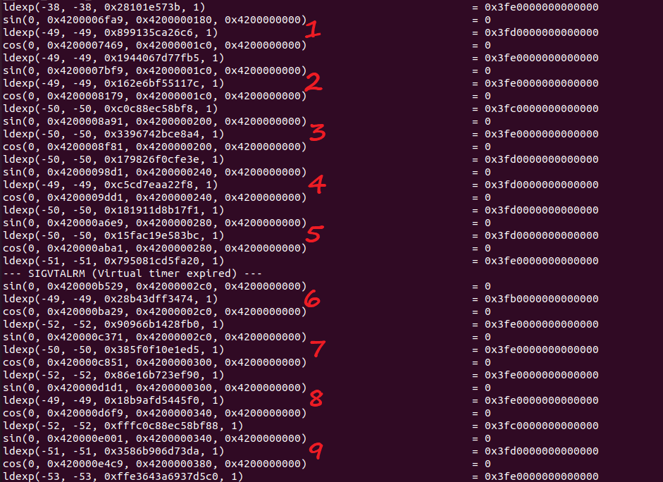
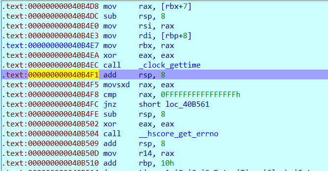
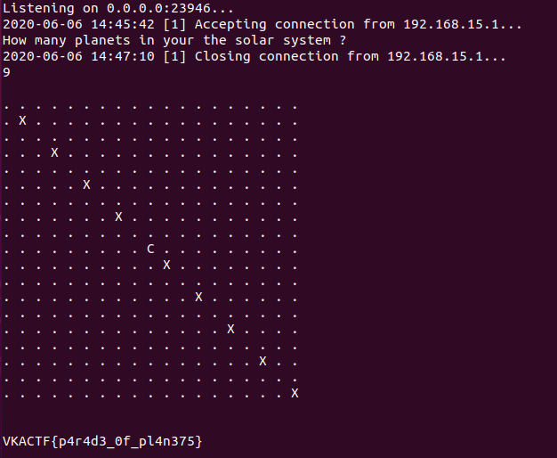

# Парад планет

|   Событие    |   Название   |      Категория      | Сложность |
| :----------: | :----------: | :-----------------: | :-------: |
| VKA-CTF`2020 | Парад планет | Обратная разработка |    КМБ    |

## Описание

> Автор: Rex
>
> 
>
> Парад планет - явление по истине уникальное. Поговаривают, что когда планеты выстраиваются в ряд в определенное время (в истории не так то много случаев) можно увидеть флаг.
>
> P.S. Как думаешь что делал Джерри?

## Решение

Первый же поиск по картинке и вопрос при запуске программы "How many planets in your the solar system ?"  связаны тем, что Плутон является планетой по задумке автора, и соответственно планет в нашей Солнечной системе должно быть 9.

Даже в календаре парада планет есть подсказка про Плутон. Но при вводе 9 по всей видимости флаг отображается неправильно...Приступаем к реверсу)

Просмотрев строки видим достаточное количество ссылок на GHC -> таск написан на haskell. Все кто пытался запустить в IDA, Ghidra и т.д. уже поняли что в лоб решать малоэффективно. Попробуем посмотреть вывод ltrace. После ввода 9 планет видим вызов такого же количества тригонометрических функций (раз на выходе модель Солнечной системы то это должно быть траектории движения планет в очень упрощенном варианте).

Мое внимание привлекло несколько time функций, поставив бряк на clock_gettime можете убедиться, что мы получаем текущее время в формате Posix. Попробуем подменить возвращаемое значение на 10 марта 1982 года (часы/минуты/секунды не считаются, значение далее делится на 86400 - то есть нам необходимо просто поставить дату 1982-3-10-xx-xx-xx).

Заменив делаем detach from process и вводим количество планет:

Наблюдаем парад планет, сдаем флаг.

> VKACTF{p4r4d3_0f_pl4n375}

